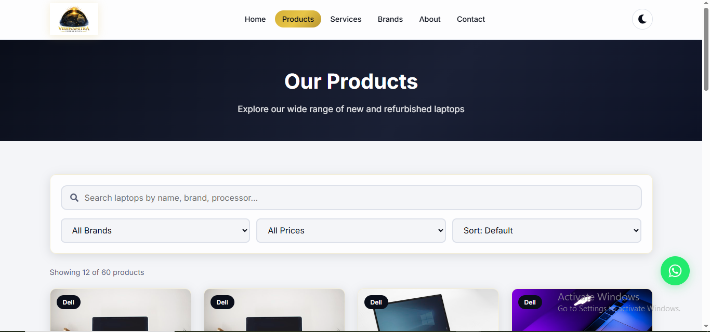
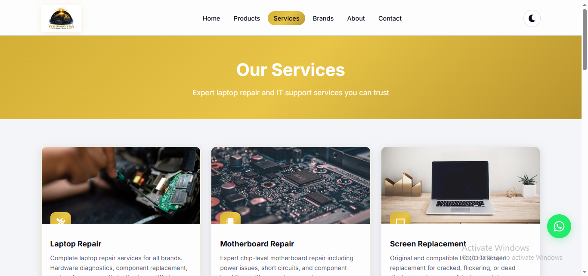
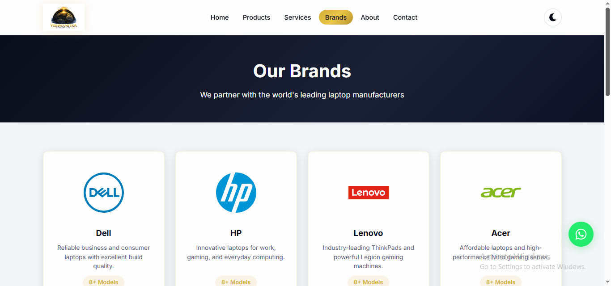
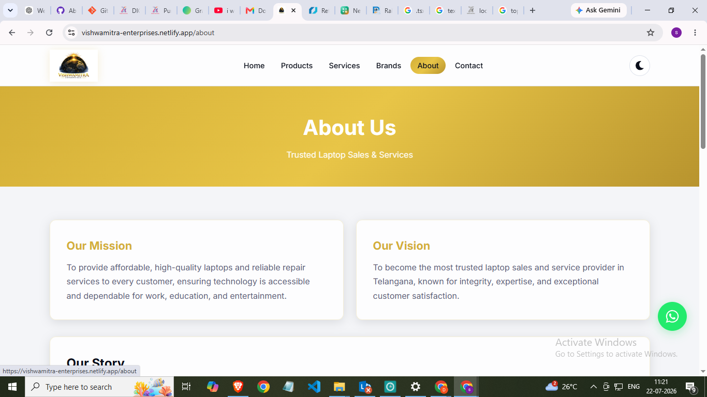
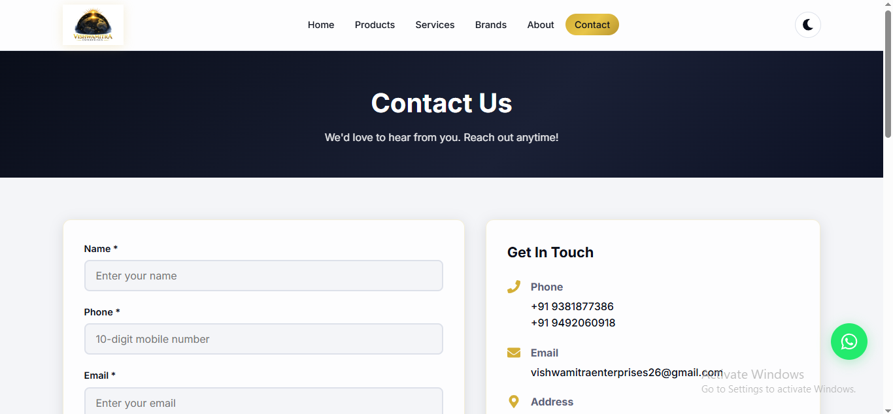

# 🖥️ Vishwamitra Enterprises

A modern, responsive and premium business website developed using **React**, **Vite**, and **Tailwind CSS**. The project features elegant UI/UX, smooth animations, responsive layouts, and optimized performance.

🌐 **Live Website:** https://vishwamitra-enterprises.netlify.app/

---

## ✨ Features

- 🚀 Modern & Professional UI
- 🌙 Light & Dark Theme
- 📱 Fully Responsive Design
- ⚡ Built with Vite
- 🎨 Smooth Animations
- 💻 Product Showcase
- 🤝 Brand Carousel
- 📞 Contact Form
- 🔍 SEO Friendly

---

## 🛠 Tech Stack

- React.js
- Vite
- Tailwind CSS
- JavaScript
- HTML5
- CSS3

---

## 📸 Project Screenshots

### 🏠 Home Page


### 💻 Products Page



### 🛠 Services Page



### 🤝 Brands Section




### 🏢 About Page



### 📞 Contact Page



---

## 🎥 Demo Video

[▶️ Download Project Demo](docs/screenshots/demovideo/Vishwamitra%20Enterprises%20-Demo.mp4)

---

## 🚀 Getting Started

```bash
git clone https://github.com/cherupallydinesh9381-alt/Vishwamitra-enterprises.git
cd Vishwamitra-enterprises
npm install
npm run dev
```

---

## 🌐 Live Demo

https://vishwamitra-enterprises.netlify.app/

---

## 👨‍💻 Developed By

**Dinesh Cherupally**

Intern | Frontend Developer


# React + Vite

This template provides a minimal setup to get React working in Vite with HMR and some Oxlint rules.

Currently, two official plugins are available:

- [@vitejs/plugin-react](https://github.com/vitejs/vite-plugin-react/blob/main/packages/plugin-react) uses [Oxc](https://oxc.rs)
- [@vitejs/plugin-react-swc](https://github.com/vitejs/vite-plugin-react/blob/main/packages/plugin-react-swc) uses [SWC](https://swc.rs/)

## React Compiler

The React Compiler is not enabled on this template because of its impact on dev & build performances. To add it, see [this documentation](https://react.dev/learn/react-compiler/installation).

## Expanding the Oxlint configuration

If you are developing a production application, we recommend using TypeScript with type-aware lint rules enabled. Check out the [TS template](https://github.com/vitejs/vite/tree/main/packages/create-vite/template-react-ts) for information on how to integrate TypeScript and Oxlint's TypeScript related rules in your project.
